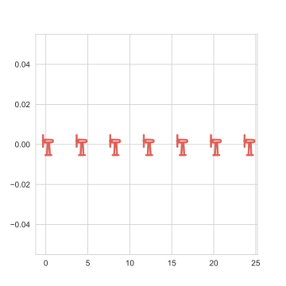
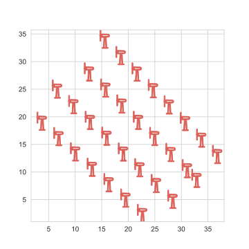
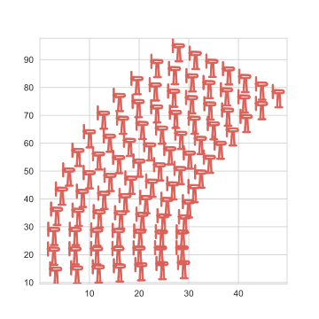

# WFCRL: Interfacing and Benchmark Reinforcement Learning for Wind Farm Control

## Environments

List all environments with:

```
from wfcrl import environments as envs
envs.list_envs()
```

All wind farms environments are implemented with both the `Gymnasium` and `PettingZoo` API, and can be run on both the `Floris` and the `FAST.Farm` wind farm simulators.

The root name of the environment is associated with a specific layout, of arrangement of turbines in the field. It is combined with a prefix and a suffix:
- A `Dec_` prefix is added before environment names to indicate an Agent Environment Cycle implementation supported by `PettingZoo`.
- A `Floris` or `FAST.Farm` suffix is added after the name of the environment to indicate the name of the background simulator.


| Root Name          | **\# Agents** | **Description**     |
|----------------------------------|--------------------|--------------------------------------------------------------------------------------|
| Ablaincourt                      | 7                  | Inspired by layout of the Ablaincourt farm    (Duc et al, 2019)            |
| Turb16_TCRWP                    | 16                 | Layout of the [Total Control Reference Wind Power Plant](https://farmconners.readthedocs.io/en/latest/provided_data_sets.html) (TC RWP) (the first 16 turbines)   |
| Turb6_Row2                      | 6                  | Custom case  - 2 rows of 3 turbines                                  |
| Turb16_Row5                     | 16                 | Layout of the first 32 turbines in the the CL-Windcon project [as implemented in WFSim](https://github.com/TUDelft-DataDrivenControl/WFSim/blob/master/layoutDefinitions/layoutSet_clwindcon_80turb.m)           |
| Turb32_Row5                     | 32                 | Layout of the farm used in the                            |
| TurbX_Row1 for X in [1, 12] | X                  | Procedurally generated single row layout with X turbines, |
| Ormonde                          | 31                 | Layout of the Ormonde Offshore Wind Farm                                             |
| WMR                              | 36                 | Layout of the Westermost Rough Offshore Wind Farm                                    |
| HornsRev1                        | 76                 | Layout of the Horns Rev 1 Offshore Wind Farm                                         |
| HornsRev2                        | 92                 | Layout of the Horns Rev 2 Offshore Wind Farm                                         |

A visual overview of some layouts:

| Turb7_Row1      | Ormonde | HornsRev2     |
|----------------------------------|--------------------|--------------------------------------------------------------------------------------|
|   |    |    |


## Example

Creating a wind farm environment of the Ablaincourt layout with the Floris background on Gymnasium:

```
from wfcrl import environments as envs
env = envs.make("Ablaincourt_Floris")
```

Examples of test cases using the PettingZoo environment are given in the `examples` folder. To simulate the `Ablaincourt` layout on FLORIS:

```
python examples/example_floris.py
```

More detailed examples can be found in the `demo.ipynb` notebook. See below under *Running Example Notebooks*.

## Installation

In the virtual environment of your choice:

```
pip install -e .
```

To get the environments simulated with FAST.Farm:

- On UNIX
```
wfcrl-simulator fastfarm
```

This requires you to have *cmake* and an MPI implementation like *OpenMPI 3*.

- On Windows

1. Download the compiled FAST.Farm 3.5.1.binaries [here](https://github.com/OpenFAST/openfast/releases/tag/v3.5.1).

2. Download **BOTH** Windows MPI setup (.exe) and MPI SDK (.msi) and install them from (https://www.microsoft.com/en-us/download/details.aspx?id=100593)
You can check your installation by entering : `set MSMPI` from `C:\Windows\System32` in the command prompt. You should obtain the following:

```
MSMPI_BENCHMARKS=C:\Program Files\Microsoft MPI\Benchmarks\
MSMPI_BIN=C:\Program Files\Microsoft MPI\Bin\
MSMPI_INC=C:\Program Files (x86)\Microsoft SDKs\MPI\Include\
MSMPI_LIB32=C:\Program Files (x86)\Microsoft SDKs\MPI\Lib\x86\
MSMPI_LIB64=C:\Program Files (x86)\Microsoft SDKs\MPI\Lib\x64\
```

You can check your installation with:

```
python examples/example_fastfarm.py
```

On Windows, it is necessary to launch the example directly with `mpiexec`:
```
mpiexec -n 1 python examples/example_fastfarm.py
```

## More details on interfacing with FAST.Farm

A simple tutorial to start a simulation with the FAST.Farm interface is available in the notebook `interface.ipynb` notebook. To properly launch the notebook, see the intructions below in *Running Examples Notebook*.

**Creating an interface from a WFCRL case:**

```
from wfcrl.environments import data_cases as cases
from wfcrl.interface import FastFarmInterface

config = cases.fastfarm_6t
interface = FastFarmInterface(config)
```

On Windows, by default, your FAST.Farm executable is assumed to be located in `simulators/fastfarm/bin/FAST.Farm_x64_OMP_2023.exe`. If not, you can also pass it to the interface:

```
interface = FastFarmInterface(config, fast_farm_executable=path_to_exe)
```


**Creating an interface from existing configuration files:**
Alternatively, if you already have your simulation fils ready, you can just point towards the `.fstf` file:
```
ff_interface = FastFarmInterface(fstf_file=path_to_fstf)
```


At every iteration, the FAST.Farm interace retrieves 12 measures per turbine:
- 2 wind measurements: wind velocity and direction at the entrance of the farm
- The current output power of the turbine
- The yaw of the turbine
- The pitch of the turbine
- The torque of the turbine
- 6 measures of blade loads

A detailed example can be found in the `interface.ipynb` notebook. To run this notebook, follow the instructions under *Running Example Notebooks*.


# Running Example Notebooks

On Windows, to run the `interface.ipynb` and `demo.ipynb` examples, you will first need to install the WFCRL kernel:

- Install `jupyter notebook` and `seaborn`:

```
pip install notebook seaborn
```

- Install the jupyter kernel

```
from wfcrl import jupyter_utils
jupyter_utils.create_ipykernel()
```
